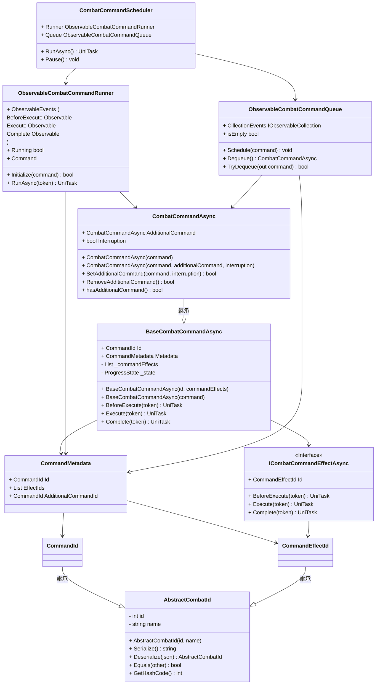

# Structure of CombatCommand

```mermaid
classDiagram
    
    class CommandId {
    }
    class CommandEffectId {
    }
    class AbstractCombatId {
        - int id
        - string name

        + AbstractCombatId(id, name)

        + Serialize() string
        + Deserialize(json) AbstractCombatId
        + Equals(other) bool
        + GetHashCode() int
    }
    CommandId --|> AbstractCombatId : 継承
    CommandEffectId --|> AbstractCombatId : 継承


    class CommandMetadata{
        + CommandId Id
        + List EffectIds
        + CommandId AdditionalCommandId
    }
    CommandMetadata --> CommandId
    CommandMetadata --> CommandEffectId


    class BaseCombatCommandAsync {
        + CommandId Id
        + CommandMetadata Metadata

        - List _commandEffects
        - ProgressState _state

        + BaseCombatCommandAsync(id, commandEffects)
        + BaseCombatCommandAsync(command)

        + BeforeExecute(token) UniTask
        + Execute(token) UniTask
        + Complete(token) UniTask
    }
    class ICombatCommandEffectAsync {
        <<Interface>>
        + CommandEffectId Id

        + BeforeExecute(token) UniTask
        + Execute(token) UniTask
        + Complete(token) UniTask
    }
    class CombatCommandAsync {
        + CombatCommandAsync AdditionalCommand
        + bool Interruption

        + CombatCommandAsync(command)
        + CombatCommandAsync(command, additionalCommand, interruption)

        + SetAdditionalCommand(command, interruption) bool
        + RemoveAdditionalCommand() bool
        + hasAdditionalCommand() bool
    }
    BaseCombatCommandAsync --> CommandMetadata
    BaseCombatCommandAsync --> ICombatCommandEffectAsync
    ICombatCommandEffectAsync --> CommandEffectId
    CombatCommandAsync --|> BaseCombatCommandAsync : 継承


    class ObservableCombatCommandRunner {
        + ObservableEvents (
            BeforeExecute Observable
            Execute Observable
            Complete Observable
        )
        + Running bool
        + Command

        + Initialize(command) bool
        + RunAsync(token) UniTask
    }
    ObservableCombatCommandRunner --> CommandMetadata
    ObservableCombatCommandRunner --> CombatCommandAsync


    class ObservableCombatCommandQueue {
        + CillectionEvents IObservableCollection
        + isEmpty bool

        + Schedule(command) void
        + Dequeue() CombatCommandAsync
        + TryDequeue(out command) bool
    }
    ObservableCombatCommandQueue --> CommandMetadata
    ObservableCombatCommandQueue --> CombatCommandAsync


    class CombatCommandScheduler {
        + Runner ObservableCombatCommandRunner
        + Queue ObservableCombatCommandQueue

        + RunAsync() UniTask
        + Pause() void
    }
    CombatCommandScheduler --> ObservableCombatCommandRunner
    CombatCommandScheduler --> ObservableCombatCommandQueue

```